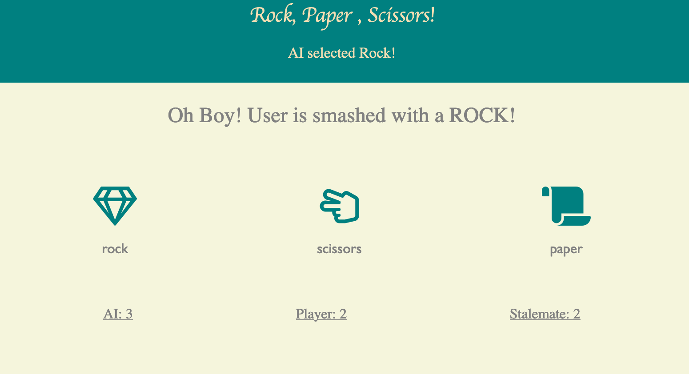

# The Odin Poject Fundamentals - JS 
## Rock & Paper & Scissors Assignment

This repo contains the Rock&Paper&Scissors assignment assigned by The Odin Project.

Here you can find the link to the assignment [Odin Fundamentals](https://www.theoddinproject.com/courses/foundations/lessons/rock-paper-scissors)

##Game Mechanics

This game is User Vs Computer style game. User makes a deliberate choice, this triggers the computer and forces it to make a choice.

Obviously, the computer choice is generated through `Math.random` 

`function aiselection(){
    let answer =  Math.floor(Math.random()* (3) +1);
    if (answer==1) {
        aiselect= 'rock';
    } else if(answer==2) {
        aiselect= 'scissors'
    }else if(answer==3){  
        aiselect= 'paper'
    }
}`

As for the User selection, I used `.forEach` then once the selection process if done, comparison engine is activated.
Based on the selections, the `result` and `subheader` parts of the markup dynamically updates.
Rules are known, thus I will not make mention of them in the readme.

This was a trial, it may need optimization and editing. 
